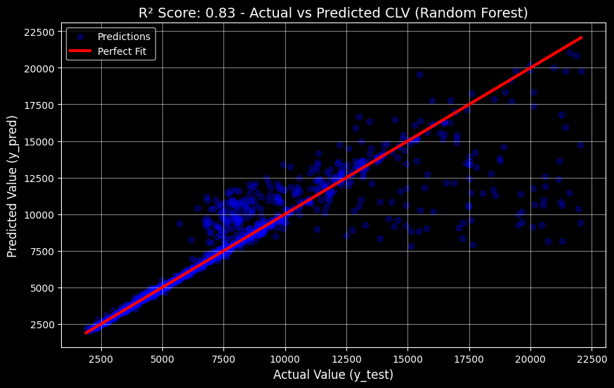

# Customer Lifetime Value Prediction Service


## Project Overview
This project is an end-to-end Machine Learning solution designed to predict the **Customer Lifetime Value (CLV)** for an insurance company. By accurately forecasting CLV, the business can identify high-value customers, optimize marketing strategies, and improve retention efforts.
The solution is not just a notebook; it is a production-ready **REST API** wrapped in a **Docker container**, making it platform-independent and easy to deploy.

## Key Features
* **Data Analysis & Engineering**: Handling skewed financial data (Log transformation), removing outliers to improve generalizability (top 5% cut-off).
* **Robust Preprocessing**: Full scikit-learn `Pipeline` handling missing values (Imputation), categorical encoding (OneHot), and scaling.
* **Modeling**: Compared Linear Regression, Random Forest, and XGBoost. The final model (**Random Forest Regressor**) achieved an **R² score of ~0.83**.
* **API Deployment**: Served via **FastAPI** with Pydantic data validation.
* **Containerization**: Fully Dockerized application for reproducible environments.

## Tech Stack
* **Language**: Python 3.9
* **Machine Learning**: Scikit-learn, XGBoost, Pandas, NumPy
* **API Framework**: FastAPI, Uvicorn
* **DevOps**: Docker
* **Tools**: Jupyter Notebook (for exploration), Joblib (serialization)

## Model Performance
The model went through several iterations of improvement:
1.  **Baseline (Linear Regression)**: R² ~0.12 (Poor fit for non-linear data).
2.  **Random Forest**: R² ~0.70 (Captured non-linear patterns).
3.  **Final Model (RF + Outlier Removal)**: **R² ~0.83** (Significant improvement by focusing on the core 95% of customers).

Key drivers of CLV identified:
* `Number of Policies` (Dominant factor)
* `Monthly Premium Auto`
* `Total Claim Amount`



## Project Structure
```text
.
├── data/                        # Raw data 
│   ├── WA_Fn-UseC_-...csv       # Original Dataset
├── models/                      # Serialized models
│   └── RandomForestRegressor.joblib  # Final Model
├── notebooks/                   # Jupyter Notebooks for experiments
│   ├── LinearRegresion.ipynb
│   ├── RandomForestRegression.ipynb
│   └── XGBoost.ipynb
├── main.py                      # FastAPI application source code
├── Dockerfile                   # Docker configuration
├── requirements.txt             # Python dependencies
├── results.png                  # Model performance visualization
└── README.md                    # Project documentation
```
## Data Source
The dataset used in this project is the **IBM Watson Marketing Customer Value Data**.
It contains information about customer demographics, policy details, and claim amounts.

* **Original Source**: [Kaggle - IBM Watson Marketing Customer Value Data](https://www.kaggle.com/datasets/pankajjsh06/ibm-watson-marketing-customer-value-data)
* **File**: `data/WA_Fn-UseC_-Marketing-Customer-Value-Analysis.csv`


## How to Run
### 1. Using Docker
* Build the image `docker build -t clv-app .`
* Run the container `docker run -p 8000:80 clv-app`
* The API should be avaliable at http://localhost:8000
### 2. Local Python Environment
* Install dependencies `pip install -r requirements.txt` 
* Run Server  `uvicorn main:app --reload`


## API Usage Example
```bash
   curl -X 'POST' \
  'http://localhost:8000/predict' \
  -H 'Content-Type: application/json' \
  -d '{
  "state": "Washington",
  "response": "No",
  "coverage": "Basic",
  "education": "Bachelor",
  "effective_to_date": "2/24/11",
  "employment_status": "Employed",
  "gender": "F",
  "income": 25000,
  "location_code": "Suburban",
  "marital_status": "Married",
  "monthly_premium": 90,
  "months_since_last_claim": 5,
  "months_since_policy_inception": 40,
  "number_of_open_complaints": 0,
  "number_of_policies": 2,
  "policy_type": "Personal Auto",
  "policy": "Personal L3",
  "renew_offer_type": "Offer1",
  "sales_channel": "Agent",
  "total_claim_amount": 300,
  "vehicle_class": "Two-Door Car",
  "vehicle_size": "Medsize"
}'
```